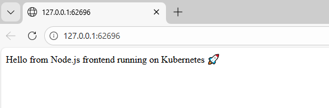
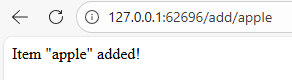
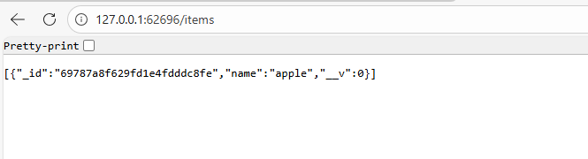
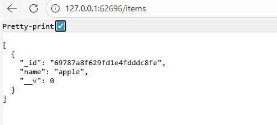

docker pull mongo:6 
docker tag mongo:6 vchenna/mongo:6 
docker push vchenna/mongo:6

Commands to execute:
kubectl apply -f secret.yaml
kubectl apply -f configmap.yaml
kubectl apply -f pvc.yaml
kubectl apply -f mongodb-statefulset.yaml
kubectl apply -f nodejs-deployment.yaml
kubectl apply -f mongodb-service.yaml
kubectl apply -f nodejs-service.yaml

Execution Steps:
PS D:\Vijay\Shama\K8s\Usecase-02> kubectl apply -f secret.yaml
secret/mongodb-secret created
PS D:\Vijay\Shama\K8s\Usecase-02> kubectl apply -f configmap.yaml
configmap/app-config created
PS D:\Vijay\Shama\K8s\Usecase-02> kubectl apply -f pvc.yaml
persistentvolumeclaim/mongodb-pvc created
PS D:\Vijay\Shama\K8s\Usecase-02> kubectl apply -f mongodb-statefulset.yaml
statefulset.apps/mongodb created
PS D:\Vijay\Shama\K8s\Usecase-02> kubectl apply -f nodejs-deployment.yaml
deployment.apps/nodejs-frontend created
PS D:\Vijay\Shama\K8s\Usecase-02> kubectl apply -f mongodb-service.yaml
service/mongodb-service created
PS D:\Vijay\Shama\K8s\Usecase-02> kubectl apply -f nodejs-service.yaml
service/nodejs-service created

PS D:\Vijay\Shama\K8s\Usecase-02> kubectl get pods
NAME                                                 READY   STATUS             RESTARTS      AGE
grafana-56d9cc8c7f-pfjcb                             1/1     Running            1 (50m ago)   12d
mongodb-0                                            0/1     InvalidImageName   0             18m
nodejs-frontend-58cd8578f-9gzcn                      1/1     Running            0             4m35s
nodejs-frontend-58cd8578f-czn5l                      1/1     Running            0             4m58s
prometheus-alertmanager-0                            1/1     Running            1 (50m ago)   12d
prometheus-prometheus-node-exporter-gp6k8            1/1     Running            1 (50m ago)   12d
prometheus-prometheus-pushgateway-68757884b8-sgj76   1/1     Running            1 (50m ago)   12d
prometheus-server-75bf475b89-cnqsr                   2/2     Running            2 (50m ago)   12d
PS D:\Vijay\Shama\K8s\Usecase-02> kubectl delete pod mongodb-0
pod "mongodb-0" deleted from default namespace

PS D:\Vijay\Shama\K8s\Usecase-02> kubectl get pods
NAME                                                 READY   STATUS              RESTARTS      AGE
grafana-56d9cc8c7f-pfjcb                             1/1     Running             1 (50m ago)   12d
mongodb-0                                            0/1     ContainerCreating   0             3s
nodejs-frontend-58cd8578f-9gzcn                      1/1     Running             0             5m1s
nodejs-frontend-58cd8578f-czn5l                      1/1     Running             0             5m24s
prometheus-alertmanager-0                            1/1     Running             1 (50m ago)   12d
prometheus-kube-state-metrics-7d98b6644-9dv5j        1/1     Running             2             12d
prometheus-prometheus-pushgateway-68757884b8-sgj76   1/1     Running             1 (50m ago)   12d

NAME                                  TYPE           CLUSTER-IP       EXTERNAL-IP   PORT(S)        AGE
grafana                               ClusterIP      10.102.108.201   <none>        80/TCP         12d
grafana-ext                           NodePort       10.109.236.9     <none>        80:31504/TCP   12d
kubernetes                            ClusterIP      10.96.0.1        <none>        443/TCP        12d
mongodb-service                       ClusterIP      10.100.124.160   <none>        27017/TCP      4m26s
nodejs-service                        LoadBalancer   10.100.160.175   <pending>     80:30663/TCP   4m30s
prometheus-alertmanager               ClusterIP      10.104.240.137   <none>        9093/TCP       12d
prometheus-alertmanager-headless      ClusterIP      None             <none>        9093/TCP       12d
prometheus-kube-state-metrics         ClusterIP      10.105.194.247   <none>        8080/TCP       12d
prometheus-prometheus-node-exporter   ClusterIP      10.108.78.59     <none>        9100/TCP       12d
prometheus-prometheus-pushgateway     ClusterIP      10.109.189.141   <none>        9091/TCP       12d
prometheus-server                     ClusterIP      10.104.128.218   <none>        80/TCP         12d
prometheus-server-ext                 NodePort       10.110.103.199   <none>        80:31810/TCP   12d
service/nodejs-service configured

PS D:\Vijay\Shama\K8s\Usecase-02> kubectl get svc
NAME                                  TYPE        CLUSTER-IP       EXTERNAL-IP   PORT(S)        AGE
grafana                               ClusterIP   10.102.108.201   <none>        80/TCP         12d
grafana-ext                           NodePort    10.109.236.9     <none>        80:31504/TCP   12d
kubernetes                            ClusterIP   10.96.0.1        <none>        443/TCP        12d
mongodb-service                       ClusterIP   10.100.124.160   <none>        27017/TCP      6m54s
nodejs-service                        NodePort    10.100.160.175   <none>        80:30080/TCP   6m58s
prometheus-alertmanager               ClusterIP   10.104.240.137   <none>        9093/TCP       12d
prometheus-prometheus-pushgateway     ClusterIP   10.109.189.141   <none>        9091/TCP       12d
prometheus-server                     ClusterIP   10.104.128.218   <none>        80/TCP         12d
prometheus-server-ext                 NodePort    10.110.103.199   <none>        80:31810/TCP   12d

PS D:\Vijay\Shama\K8s\Usecase-02> kubectl get pods
NAME                                                 READY   STATUS    RESTARTS      AGE
grafana-56d9cc8c7f-pfjcb                             1/1     Running   1 (53m ago)   12d
mongodb-0                                            1/1     Running   0             3m
nodejs-frontend-58cd8578f-9gzcn                      1/1     Running   0             7m58s
nodejs-frontend-58cd8578f-czn5l                      1/1     Running   0             8m21s
prometheus-alertmanager-0                            1/1     Running   1 (53m ago)   12d
prometheus-kube-state-metrics-7d98b6644-9dv5j        1/1     Running   2             12d
prometheus-prometheus-node-exporter-gp6k8            1/1     Running   1 (53m ago)   12d
prometheus-prometheus-pushgateway-68757884b8-sgj76   1/1     Running   1 (53m ago)   12d
prometheus-server-75bf475b89-cnqsr                   2/2     Running   2 (53m ago)   12d
PS D:\Vijay\Shama\K8s\Usecase-02>
PS D:\Vijay\Shama\K8s\Usecase-02>
PS D:\Vijay\Shama\K8s\Usecase-02> minikube service nodejs-service
┌───────────┬────────────────┬─────────────┬───────────────────────────┐
│ NAMESPACE │      NAME      │ TARGET PORT │            URL            │
├───────────┼────────────────┼─────────────┼───────────────────────────┤
│ default   │ nodejs-service │ 80          │ http://192.168.49.2:30080 │
└───────────┴────────────────┴─────────────┴───────────────────────────┘
🏃  Starting tunnel for service nodejs-service./┌───────────┬────────────────┬─────────────┬────────────────────────┐
│ NAMESPACE │      NAME      │ TARGET PORT │          URL           │
├───────────┼────────────────┼─────────────┼────────────────────────┤
│ default   │ nodejs-service │             │ http://127.0.0.1:62696 │
└───────────┴────────────────┴─────────────┴────────────────────────┘
🏃  Starting tunnel for service nodejs-service.
🎉  Opening service default/nodejs-service in default browser...
❗  Because you are using a Docker driver on windows, the terminal needs to be open to run it.

Output:

1. Access the Node.js Application via Exposed Service

The tunnel is started for nodejs-service and we could see the node-js page:

I tried to add an apple as an item using the URL and it is added.

Later, tried to fetch the items and it worked.

2. Confirm MongoDB Connectivity and Data Persistence

> kubectl logs <nodejs-pod-name>

kubectl get pods
NAME                                                 READY   STATUS    RESTARTS      AGE 
nodejs-frontend-58cd8578f-czn5l                      1/1     Running   1 (97s ago)   30m
prometheus-alertmanager-0                            1/1     Running   1 (76m ago)   12d
prometheus-prometheus-node-exporter-gp6k8            1/1     Running   1 (76m ago)   12d

PS D:\Vijay\Shama\K8s\Usecase-02> kubectl logs nodejs-frontend-58cd8578f-9gzcn

> nodejs-frontend@1.0.0 start
> node server.js

Node.js app listening on port 3000
✅ Connected to MongoDB

To Verify data persistence:
Deleted the mongodb pod
> kubectl delete pod mongodb-0

> kubectl get pods

Re‑checked items and I am able to see the items:

--------------------------------------------
Optionally, We can connect directly to MongoDB:

PS D:\Vijay\Shama\K8s\Usecase-02> kubectl exec -it mongodb-0 -- mongosh -u mongouser -p securepass --authenticationDatabase admin
Current Mongosh Log ID: 69787d09623f90a6748de665
Connecting to:          mongodb://<credentials>@127.0.0.1:27017/?directConnection=true&serverSelectionTimeoutMS=2000&authSource=admin&appName=mongosh+2.5.10
Using MongoDB:          6.0.27
Using Mongosh:          2.5.10

For mongosh info see: https://www.mongodb.com/docs/mongodb-shell/

To help improve our products, anonymous usage data is collected and sent to MongoDB periodically (https://www.mongodb.com/legal/privacy-policy).
You can opt-out by running the disableTelemetry() command.

------
   The server generated these startup warnings when booting
   2026-01-27T08:49:56.052+00:00: Using the XFS filesystem is strongly recommended with the WiredTiger storage engine. See http://dochub.mongodb.org/core/prodnotes-filesystem
   2026-01-27T08:49:56.996+00:00: vm.max_map_count is too low
------

test> db.items.find()

test> use testdb
switched to db testdb
testdb> db.items.find()
[
  { _id: ObjectId('69787a8f629fd1e4fdddc8fe'), name: 'apple', __v: 0 }
]
testdb>

